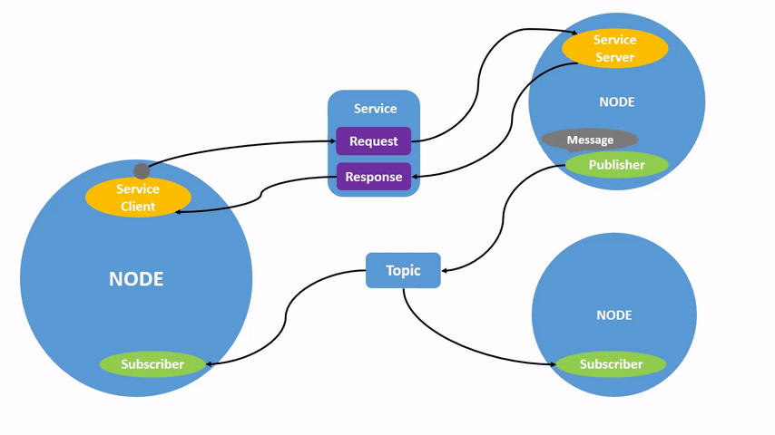

# LIDARa_pointnet_recognition_ROS - dokumentacja

## Co to ROS?
Robot Opetating System (ROS) to framework do C++ i Python, który służy do programowania robotów. Zawiera w sobie narządzia oraz biblioteki wykorzystywane przy pracy z różnymi sensorami. Ma dosyć prostą strukturę, dzięki czemu jest intuicyjny i dość łatwy do zrozumienia. Poszczególne części robota porozumiewają się poprzez Nody - czyli mniejsze podprogramy, które dają możliwość publikowania oraz subscribowania topiców. Topic to informacja, która jest publikowana przez noda zawierająca infomrację np o pozycji, zdjęciu czy chmurze punktów. Istnieją również serwisy, które różnią się tym od topiców, które są publikowane tak często jak to możliwe, że wywoływane są tylko w momencie poproszenia o to poprzez innego noda.
Schemat działania ROSa:


## Teoria
Repozytorium zawierające paczki ROSowe do detekcji pachołków z chmury punktów LIDARa. Algorytm składa się z kilku etapów:

1. Otrzymanie chmury punktów z LIDARa Ouster OS 128 za pomocą topica rosowego PointCloud2
2. Usywanie ziemi z chmury punktów za pomocą algorytmu Patchwork ++
3. Segmentacja punktów położonych ponad poziomem potencjalnych pachołków
4. Klasteryzacja euklidesowa i wyciągnięcie potencjalnych chmur punktów, które mogą być pachołkami
5. Wykorzystanie modelu sztucznej inteligencji w celu klasyfikacji 'Cone' w przypadku pachołka i 'Non-cone' w przeciwnym przypadku

## Implemantacja
### Patchwork ++
[GitHub](https://github.com/url-kaist/patchwork-plusplus-ros/tree/master)

[Research](https://arxiv.org/abs/2207.11919)

Open source. Paczka ROSowa z implementacją algorytmu Patchwork ++. Zmianie uległo usunięcie zbędnych obliczeń i publikacji chmur punktów, które nas nie interesują. 

Istotny ROS topic to ```/demo/nonground```, który zawiera chmurę punktów pozbawioną ziemi
### lidar_cone_detection
Paczka zawira dwa nody rosowe. To podprogramy służące do pomniejszych obliczeń.
- euclidean_clustering_node - segmentacja chmury punktów oraz klasteryzacja
    1. Segmentacja punktów położonych ponad potencjalnym gruntem, gdzie nie może być pachołków
    2. Klasteryzacja euklidesowa z ograniczonej chmury
- pointnet_recognition - pythonowy node służący korzystający z biblioteki Tensorflow do klasyfikacji i wykorzystania modelu
    1. Załadowanie wag otrzymanego modelu
    2. Otrzymanie chmury punktów i wykorzystanie modelu
    3. Sprawdzenie potencjalnych pachołków i dodanie ich do nowej chmury

### Model AI
JupyterNotebooks znajdują się w katalogu 'model_train'. Wykorzystana została biblioteka TensorFlow. 

#### Dataset
Modele wytrenowane są na pachołkach z datasetu [ModelNet40](https://modelnet.cs.princeton.edu/) z wyszczególnieniem jedynie obiektów 'cones'.

#### Trening
Model składa się z warstw konwolucyjnych oraz warstw 'fully connected':
```python
def conv_bn(x, filters):
  x = layers.Conv1D(filters, kernel_size=1, padding='valid')(x)
  x = layers.BatchNormalization(momentum=0.0)(x)
  return layers.Activation('relu')(x)

def dense_bn(x, filters):
  x = layers.Dense(filters)(x)
  x = layers.BatchNormalization(momentum=0.0)(x)
  return layers.Activation('relu')(x)
```
Wykorzystana została funkcja ReLU oraz Batch Normalization. 

## Uruchomianie
### Wymagania
- Ubuntu 20.04
- Docker
- Ros Noetic

### Docker

```bash
docker compose up
```

Po odpaleniu dockera włącza się od razu Rviz, czyli rosowy program do wizualizacji danych. Możemy zobaczyć 3 rostopic:

- /ouster/points - originalny obraz chmury punktów z LIDARaa otrzymany z Oustera zawieara około 270 tyś punktów
- /euclidean_clustering/markers - zaznaczone w chmurze punktów potencjalne klastry, które są analizowane przez model
- /pointnet_cones - chmura punktów zawiarająca jedynie sklasyfikowane pachołki 
 
#### May the whale🐳 be with you young padawan!

### ROS Kinetic
Kompilacja kodu:
```bash
mkdir -p ros_ws/src
cd ros_ws/src
git clone git@github.com:adakPaleczny/lidar_pointnet_recognition_ROS.git
cd ..
catkin_make
source devel/setup.bash
```
Włączamy launcha:
```bash
roslaunch lidar_cone_detection lidar.launch
```